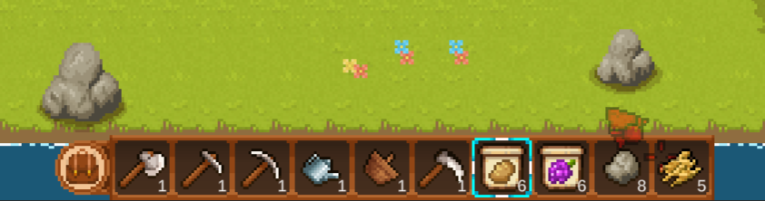
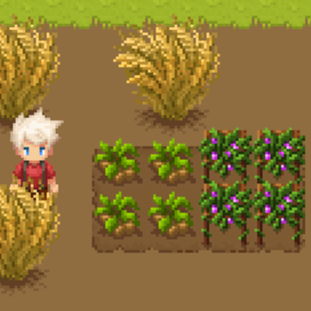
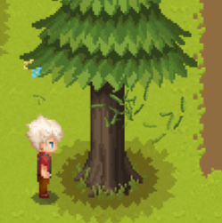
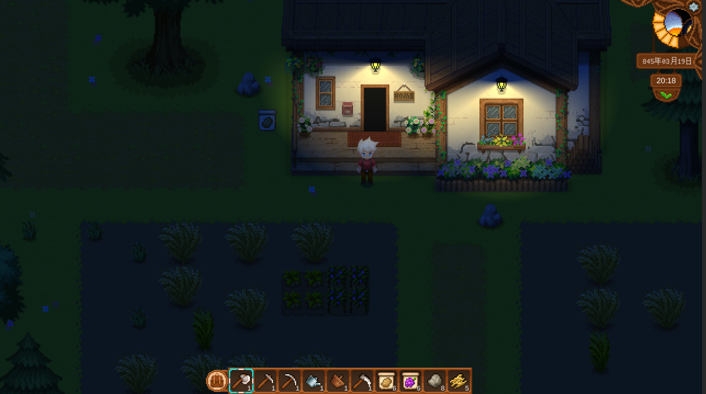
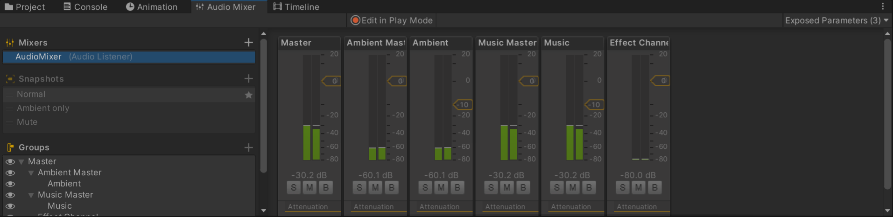
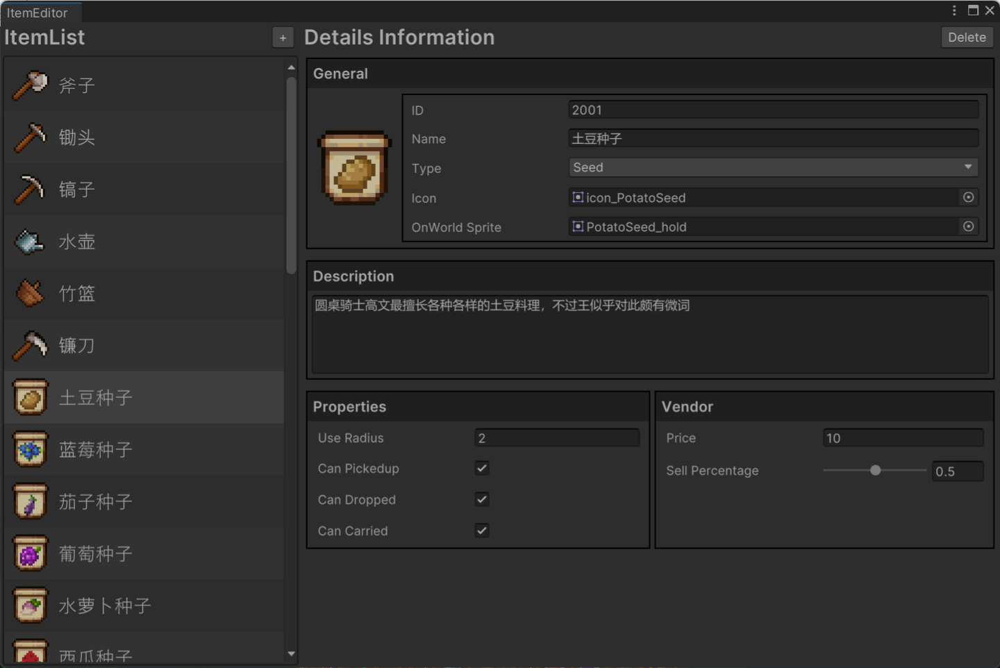

# 项目概览  Project Overview

### 地编
* 使用rule tiles进行分层瓦片地图绘制
* 使用Sprite atlas进行性能优化
* 制作地图信息系统，使用SO文件按场景存储每个地块的各项属性，根据代码自动生成和更新（ExecuteInEditMode）

### 动画
- 使用AE导出序列帧制作动画素材
- DOTWEEN插件制作渐变动画（alpha值一律用Mathf.Approximately()判断）
- BlendTree制作animator controller
- 由于游戏为2.5D视角，角色向后（背对屏幕）使用工具时，在工具动画中添加order in layer=-1关键帧，使人物遮挡住工具
- 使用Timeline制作开场/过场动画

### 背包系统
- tooltip追随鼠标位置
- 物品拖拽实现调整位置、快捷交易与丢弃（类似terraria）
- 可制作箱子存放物品 

### 种植系统
- 玩家使用锄头创造可播种地块后即可放置种子，种子随时间自动生长，到达可收获阶段后即可采摘，部分作物在收获后可退回成熟阶段，一段时间后可再次收获
- 砍树获得的果实亦可种植 

### 合成系统
- 可使用图纸无限次数制作物品（需要消耗原材料）

### NPC
- A*算法构建路径，跨场景移动事先设置好传送位置并分段构建路径
- 部分NPC处可进行交易
- 对话与移动路线存储于SO文件

### 特效
- shader特效：
- 粒子特效：砍树造成的树叶飘落特效、凿石头的石块飞溅特效、割草的草絮飞舞特效  

### 场景加载
- 手动实现可序列化Vector3保存物品坐标
- BasicScene存放Player、MainCamera和各个单例Manager，UI单独存放于一个场景，各地图分别存放于一个场景，载入地图时以additive方式加载地图场景
- 卸载场景时将玩家创建的物品（种植的作物、建造的家具等）保存到字典，重新加载场景时进行还原

### 控制
- 键盘控制移动+快捷键，鼠标使用工具+交互（类似terraria）
- 鼠标控制核心流程：
  1. 若正与UI交互，或未选中物品，则鼠标与大世界无交互；
  2. 选中物品后触发事件 设置光标样式，切换人物animator override controller，并根据所选物品的类型和数据、光标指向地块/物品的属性、以及光标与玩家位置的距离判断是否可进行相应操作，若不满足条件则设置光标为禁用样式；
  3. 若满足条件则左键点击可触发相应事件，启动协程执行动画，然后完成行为逻辑，刷新UI

### 渲染
- 使用Unity通用渲染管线2D，材质使用Sprite-Lit-Default
- 主要实现黎明-白昼-黄昏-夜晚的昼夜更替光照变化，和场景中的点光源
   

### 音乐音效
- 使用AudioMixer混合背景音乐、环境音、音效等，并允许玩家调节游戏音量
- 通过广播事件方式启动音效，创建音效对象池使得多种音效能同时播放，脚步声使用动画关键帧事件
- 播放音效时给予随机pitch（频率/音高）波动，提高真实感
   

### Sprites处理
- 切割边框使得调整长宽不会使图片变形
- asperite软件进行UI图片微调
- 牢记CreateEmpty后要Reset坐标

### 插件/工具
- EditorWindow自定义物品编辑器
- 自定义Attribute
   

### UI
- UGUI:  使用 Layout Group + Content Size Fitter + Layout Element 调节UI布局
- 打开暂停界面时强制执行一次垃圾回收 System.GC.Collect();

### 数据持久化
- 为每个要存储数据的对象生成一个GUID，每个存档维护一个字典，key和value分别是每个对象的GUID和要存储的数据（序列化为JSON string），读档时根据GUID进行加载
- 枚举类型变量序列化时转为int保存，读取时重新转换回Enum

### 设计模式
为避免纸上谈兵，这里只选几个有代表性且有显著效果的best practice:
- 单例模式：全局管理对象
- 观察者模式：事件中心（核心作用：体现开放封闭和单一职责原则，无需修改之前已完成的代码，如须扩展功能只需要在新class中添加对某一事件的订阅，并在该事件发生时在类体内部执行相应逻辑，发布者无需关注订阅者的行为，也不需要知道谁是订阅者，订阅者也无法对发布者产生影响） 
    比如场景管理class在执行场景切换后只需要广播该事件，订阅该事件的class自行完成后续逻辑，无论是新的class需要订阅该事件、还是有class取消订阅、或者修改其响应方法，都与场景管理class无关
- 对象池模式：背包滚动加载（防止初始化卡顿）/粒子特效（避免大量创建和销毁对象）/播放音效（避免新音效覆盖旧音效）
- 组件式编程：Unity架构本身就很好地体现了解耦的思想，实体被定义为组件的容器，利用组合/聚合关系代替继承，避免处理繁琐的类间继承关系。在自主设计代码结构时，对于重合部分也尽量采用编写单独的script作为组件的方法来实现复用（Vue也是类似的设计）
- 面向接口编程：无论是函数指针、接口还是依赖注入，本质还是为了解耦&规范化代码。譬如为需要持久化的类实现ISaveable接口，提供默认注册方法并要求其实现读存档逻辑
- 原型模式：合成物体比如制作一个箱子时，实例化prefab+克隆一份模板SO文件

### 其他
- JetBrains yyds！你IDE字里行间跃动的电光，是我此生不灭的信仰
- 不论是写小说、做视频、写游戏、建模做场景、企划产品还是什么，涌现创意、记录想法的时候是真快乐，但如果你要坚持把这个事情做完整达到能发布的程度，真的会耗费巨量的精力，中后期很痛苦，但完成以后又是快乐的了
- 老老实实学CG，不然永远停留在“软件使用”水平。虽然熟练掌握一种DCC工具或游戏引擎已经很不容易

**游戏网盘链接：**